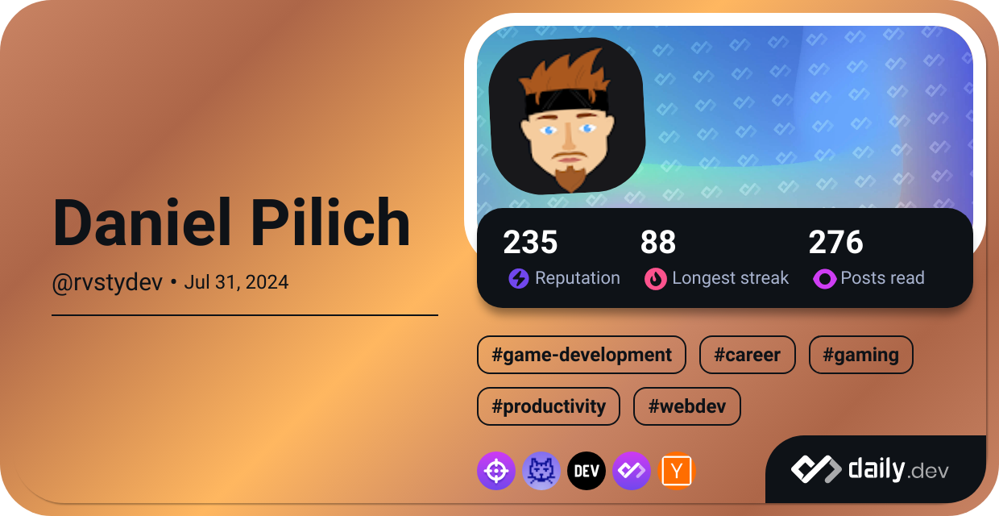

# Hey 👋
I'm very happy that my profile caught your attention and I hope you find what you are looking for.

Maybe we can even try to create something together?
> Check my portfolio page: [Portfolio](https://danielpilich.github.io/)
### 🔭 What I am currently working on
I'm currently working on my own games and challenging myself by participating in all sorts of GameJams. 
On GitHub you can see all the major projects I've participated in, and on itch.io you can play the games I've managed to bring to a playable version. 
> Catch the link from me 😉: [My itch.io page](https://daniel-rusty-pilich.itch.io/)
### 🌱 What I'm currently learning
I'm currently learning the Godot engine and the GDScript language, that's what I'm putting the most emphasis on. In addition, I'm constantly trying to find myself in the field of Computer Science, so I'm further educating myself in the C# language, in which I already have professional experience, and following new information from the programming world to try something new.

### 📫 How to reach me
The easiest way to contact me is through the LinkedIn platform, where you can find information about my experience by the way: 
> Here is a link: [My LinkedIn profile](https://www.linkedin.com/in/daniel-pilich/)
### ⚡ Fun facts
- I am an avid gamer, I like to get achievements in games by testing them to the limit and play them to 100%. (Yes I am a ~~crazy~~ completionist 🤪).
- I play guitar and kalimba, in which I find a moment of relaxation. (Of course, games are also relaxing, nevertheless, listening to the sounds I make on the instrument myself is extremely calming 😄).
- To refresh my mind, I regularly exercise at the gym, which allows me to take my mind off intense problem-solving for a while and focus on improving my posture. (Sometimes I take on the role of a trainer 😁).
